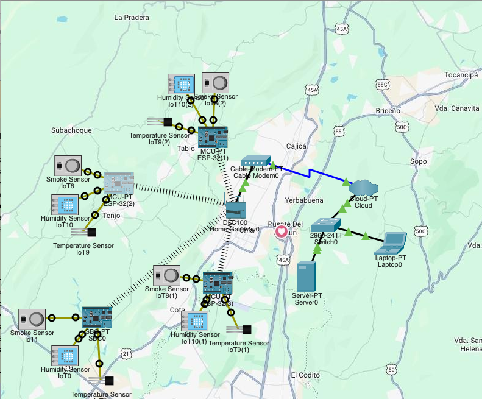

# AirQuality-WSN-Sabana: Monitoreo IoT de Calidad del Aire

Bienvenido al repositorio oficial del proyecto de conectividad IoT para el monitoreo de la calidad del aire en los municipios de Cota, Tabio y Tenjo.

  

## 🚀 Acceso a la Documentación Completa

Toda la información detallada sobre el diseño de la red, la implementación del protocolo MQTT, el código fuente de los SBC y el proceso de validación en Cisco Packet Tracer se encuentra en nuestra Wiki.

👉 <a href="https://github.com/Firewallrbn/AirQuality-WSN-Sabana/wiki/Dise%C3%B1o">WIKI<a/>👈

---

### 🛠️ Tecnologías Clave Utilizadas
* **Protocolo:** MQTT (Message Queuing Telemetry Transport)
* **Simulador:** Cisco Packet Tracer
* **Lenguaje:** Python (para scripts de nodos SBC)
* **Formato de Datos:** JSON

### 👥 Integrantes del Equipo
* Juan David Cruz Angel
* Julian David Aguilar Zambrano
